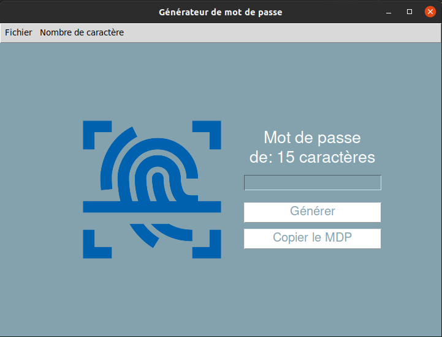

# Password Generator


A simple tool for generate strong password



## installation

- install tkinter -> ```pip install tk```
- install pyperclip -> ```pip install pyperclip```

On Linux install one of the copy/paste mechanisms:

- ```sudo apt-get install xsel``` to install the xsel utility.
- ```sudo apt-get install xclip``` to install the xclip utility.
- ```pip install gtk``` to install the gtk Python module.
- ```pip install PyQt4``` to install the PyQt4 Python module.
